# Cloudera Data Science Workbench Handson Workshop
Tour of Cloudera Data Science Workbench / Cloudera Machine Learning

## Workbench
There are several scripts provided which walk through the interactive capabilities of Cloudera Data Science Workbench.

1. **Basic Python visualizations (Python 2).** Demonstrates:
  - Markdown via comments
  - Jupyter-compatible visualizations
  - Simple console sharing
2. **PySpark (Python 2).** Demonstrates:
  - Easy connectivity to (kerberized) Spark in YARN client mode.
  - Access to Hadoop HDFS and S3 (e.g. `hdfs dfs -ls /`).
3. **R** Demonstrates:
  - Run standalone R code on CDSW, showing arules library
  - Use sparklyr to benefit from the Spark engine in your R application
4. **Advanced visualization with Shiny (R)** Demonstrates:
  - Use of 'shiny' to provide interactive graphics inside CDSW
5. **Jobs** Demonstrates:
  - Use the easy to use self-service batch framework
6. **Working with Experiments and Models** Demonstrates:
  - Batch interface for running experiments in Batch while changing hyperparameters.
  - Capture experiment key results
  - Deploy the best predictive model as a REST service
7. **Applications** Demonstrates:
  - Self-serivice framework to deploy your own applications


#  INTRODUCTION
Cloudera Data Science Workbench is a new product from Cloudera launched in May 2017. It is based on the acquisition of Sense.io that we made in March 2016. Cloudera has taken this product, enhanced it and ensured that all workloads can be pushed down to Cloudera.

&nbsp;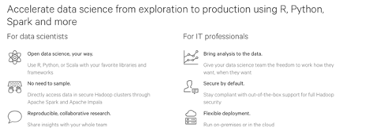

Cloudera Data Science workbench supports the R, Python, Scala programming languages. That capability could certainly be useful to Cloudera; the software could enable companies to make the most of their data scientists, who can then be more efficient with their use of company time and
infrastructure.

&nbsp;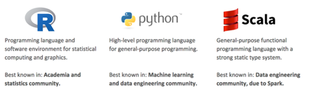

Cloudera’s goal with Cloudera Data Science workbench is to Help more data scientists use the power of Hadoop, make it easy and secure to add new users, use cases.

Why Hadoop for Data Science? Well here are the reasons:
- High volume, low cost shared storage - More data more kinds of data
- Parallel compute local to the data - more experiments, better results
- Scalable, fault tolerant - easy to scale out, not just scale up
- Flexible multipurpose data platform - easier path to production
- Superior flexibility and price / performance to any other data platform

## Lab 1 - Login to Cloudera Data Science Workbench (CDSW)

In this lab you’ll learn how to:
- Login to a Cloudera Data Science Workbench instance
- Set your Hadoop Authentication
- Navigate the Cloudera Data Science Workbench application

First thing you need to use the provided http link to your Cloudera Data Science Workbench environment. Login to this environment using the user ```admin``` and the provided password.

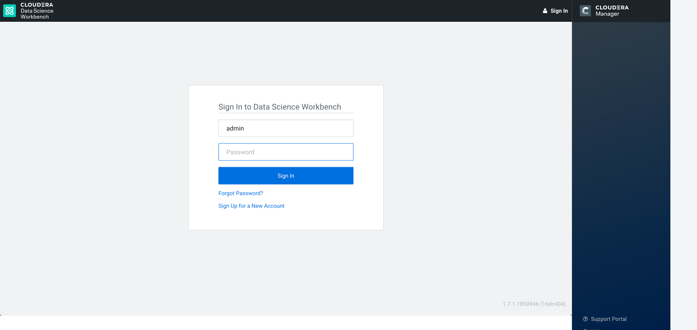

## Lab 2 - Creating a new project
When you have logged in, you will se the following screen:

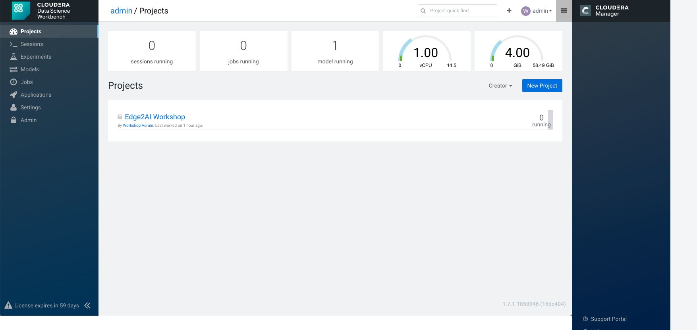

You have on the left hand panel:
- Projects - where you create data science projects
- Sessions - Python, Scala or R sessions
- Experiments - batch experiments
- Models - build, deploy, and manage models as REST APIs to serve predictions
- Jobs - Run and schedule jobs and add dependencies
- Applications - Run self-built applications
- Settings - User, Hadoop Authentication, SSH Keys and permission settings
- Admin - Manage your Cloudera Data Science Workbench environment

In the top right hand corner you have:
- **Search bar** for search for projects
- **+**	adding new projects or new teams
- **User name** Account settings and Sign out - Same as settings in home screen
-  menu to external tools like Hue, Cloudera Manager and others

Lets create a new project, by selecting the  button.

Copy and paste this GitHub URL into the Git tab.
```
https://github.com/andremolenaar/cdsw_workshop_v2.git
```
Project name = Something like your name and Labs, and hit the ```Create Project``` button.

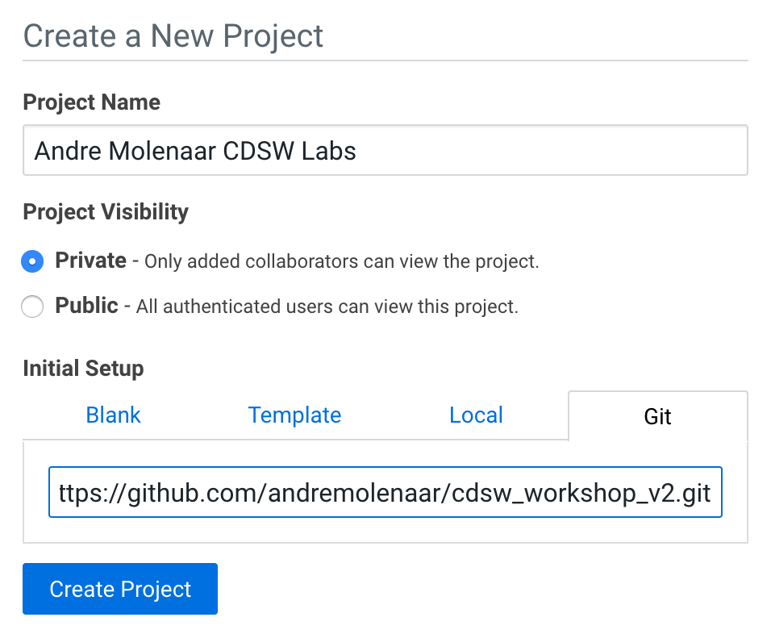

When the project is created, you will see a screen similar to this:

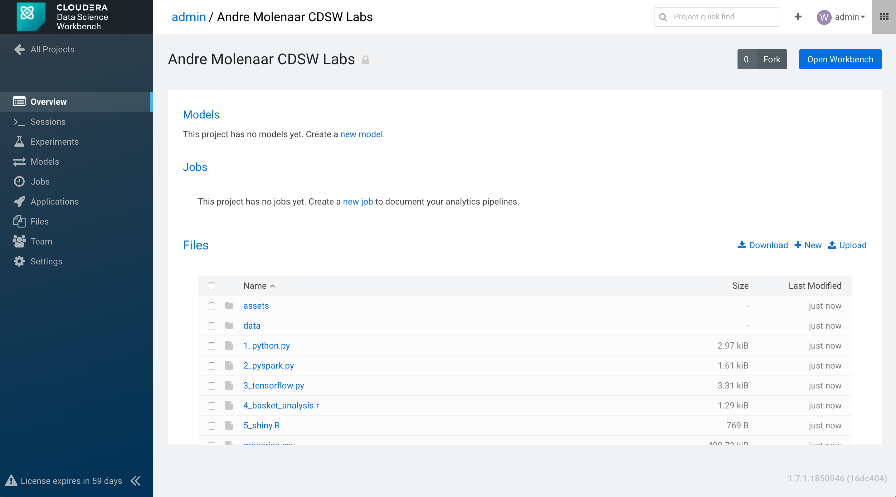

Now, Launch a Python 3 Session by selecting the 'Open Workbench' button, populate the options:
- Editor: workbench
- Engine Kernel: Python 3
- 1 vCPU / 2 GiB Memory
And hit the ```Launch Session``` button

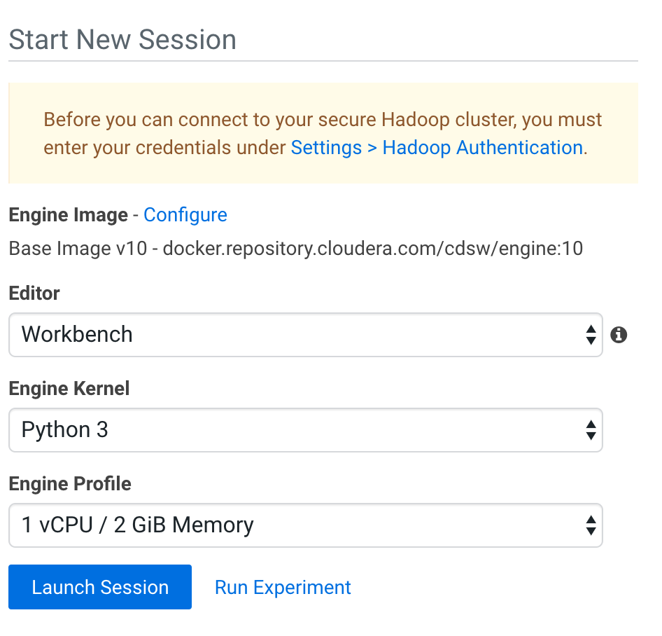

After a few seconds, you will get to your workbench screen with a running Python3 engine.

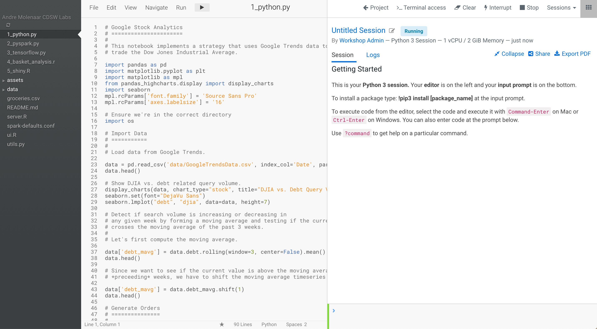

1.	On the far left is a file browser (note the little ‘refresh’ icon at the top:  )
2.	In the middle is an editor open on the file that you selected - in this case the README.md file.
3.	On the right is your running session, with your python3 command prompt in the bottom. A green bar indicates it is ready to process something. When it is processing, it will turn red.

Lets enrich our Python3 environment with additional libraries.
Run the following commands from the python command prompt:

```Python
!pip3 install --upgrade dask
!pip3 install --upgrade keras
!pip3 install --upgrade matplotlib==2.0.0.
!pip3 install --upgrade pandas_highcharts
!pip3 install --upgrade protobuf
!pip3 install --upgrade tensorflow==1.3.0.
!pip3 install --upgrade seaborn
!pip3 install --upgrade numpy
```
You can copy all those statements, and paste it at the python3 prompt.
When the libraries have been installed, you should see something like this:

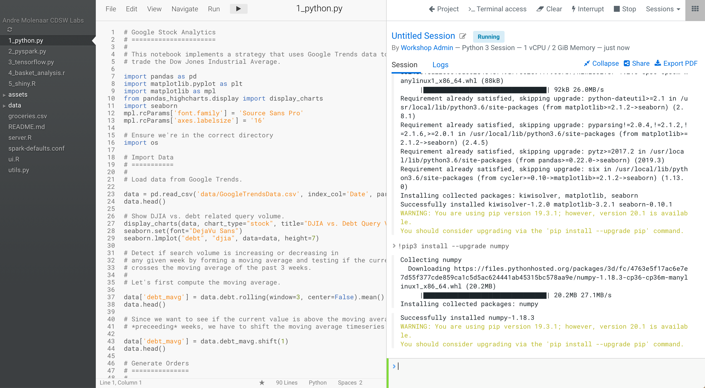

## Lab 3 - Visualization and Sharing

Data Science is often about visualizing ideas, and then sharing them to persuade others to take action. CDSW lets you use the visualization tools you’d use naturally, and adds a neat twist to the whole idea of sharing.

Let’s get started:
1.	Start up a Python 3 session (1vCPU, 2GiB) in the same manner you did before. If your Python session is still running, you may reuse it. You might want to hit the ```Clear``` button in the right top, to clean your console screen.
2.	Select 1_python.py in the file browser
3.	Run the entire file (multiple ways of doing that - try to figure out more than one way. It should be pretty obvious!). One way of doing it would be to select the ```Run``` menu above your program code.

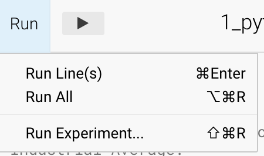

4. You should end up with some nice graphs in the output window:

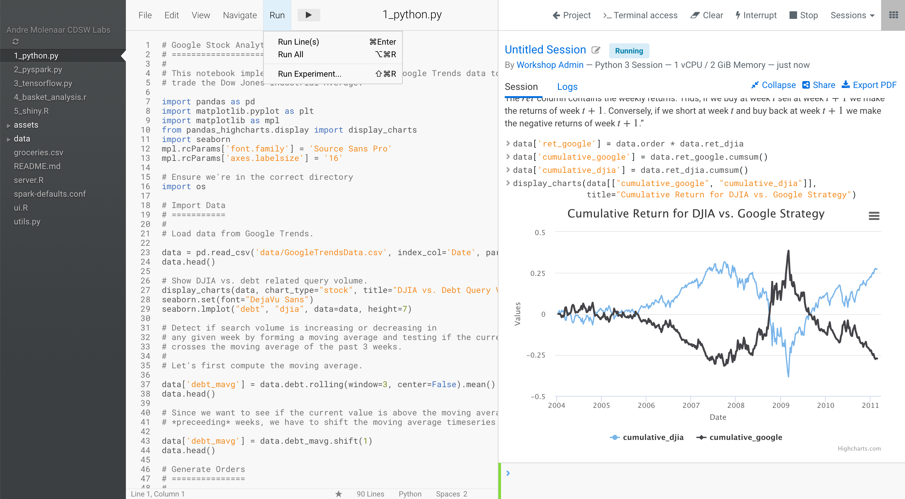

5. You can see that CDSW is very similar to a notebook, supporting the same visualization tools. However, unlike a notebook, it doesn’t use cells: instead it uses markup in the source file, and an output window. Furthermore, that window has some interesting properties …

6. Scroll up to find this diagram:

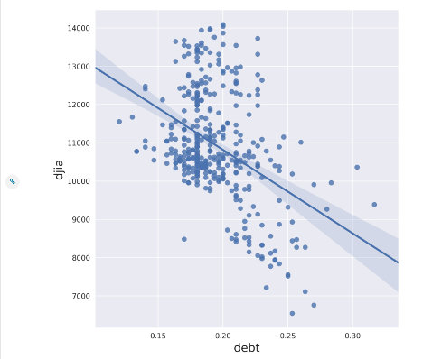

7. On the left is a little chain link button: 

8. Click on it and you’ll see beneath the chart some html that can be used to embed that chart into a website:

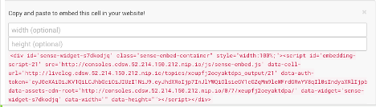

9. Scroll to the top of the window and you’ll see this on the far right (the exact layout depends upon the real estate available – you might have to expand your browser window to see the following links and they might be laid out vertically or horizontally):


10. Hit the ```collapse``` link and see the difference in the output window.

11. Question: What difference did you see? How might this be used? Is it useful?

12. Notebooks have great output, but how do you share what they show you? CDSW solves this by simply providing a link to the output that you can send to anyone and they can see the output. Try it:

13.	Select the ```Share``` link:

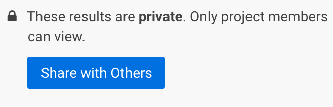

14.	And then ```Share with Others``` (your URL will be similar, but different from this one):

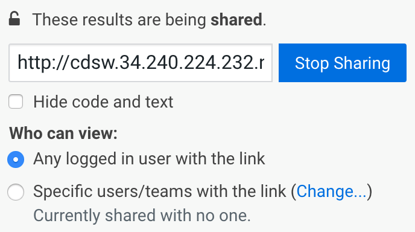

15.	Cut and paste that link and put it into another tab of your browser and see what happens.

16.	You should see that you have access to almost the same output window (this new one doesn’t have this share link!)


So we’ve demonstrated how CDSW is like a notebook, but is perhaps more powerful, and has great sharing capability. Let’s go on to see about integration with Hadoop and Cloud Object Stores.

## Lab 4 - Hadoop Integration
In this lesson we’ll see two mechanisms for integrating with Hadoop:
1. Filesystem - storing data in Hadoop itself using HDFS
2. Computation - executing code on the Hadoop cluster via Spark

Execute the following instructions.

1. Clean up your Python session by hitting the ```clear``` button and the ```expand``` link (if available)

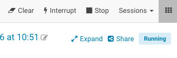

2. Select the 2_pyspark.py file

3. If you don’t have a Python 3 workbench session open yet, Launch a Python 3 session 1 vCPU / 2 GB RAM

4. Run line 32:

5. ```!hdfs dfs -put -f $HOME/data/kmeans_data.txt /user/$HADOOP_USER_NAME```

6. Execute the 2_pyspark.py file in your already running Python session

7.	Question: What did it do?

8.	Question: What kind of thing is the variable ‘data’? (try typing ‘data’ into the console and seeing what gets printed out.

9. Open a terminal using the ```terminal``` icon in the top right:

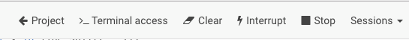

10. Execute ```hdfs dfs -ls``` to see the data file in the hadoop file system (or, to show off, execute ```! hdfs dfs -ls``` in the python console to do the same thing!)

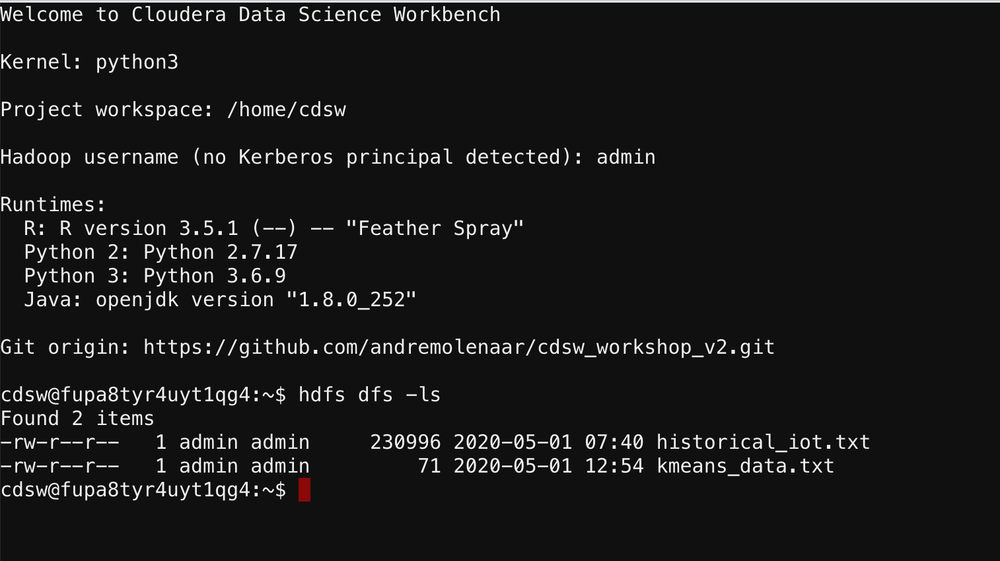

If everything went correctly you’ll see that we demonstrate:
-	Natural integration with HDFS - it’s just a path to a file!
-	Natural parallel computation across the cluster using Spark

You may stop your session now by hitting the ```Stop``` button above your session log.

## Lab 5 - Runnng R code

We’ve focused on python integration, but just to show we can do similar things with R, let’s take a look at the R programs and execute them.

This lab requires that R is setup with some additional libraries, similar like we did with Python before.

1. Create a new R Session.

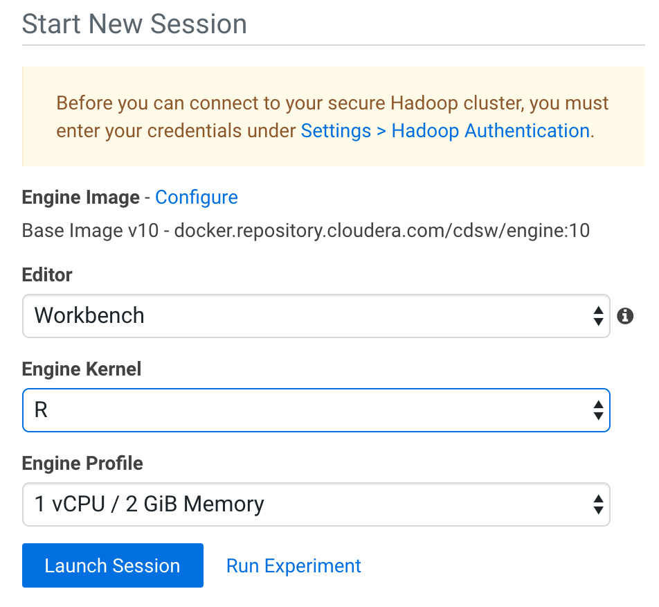

2. In an R Session, run these commands:
```R
install.packages("tidyverse")
install.packages('sparklyr')
install.packages('plotly')
install.packages("nycflights13")
install.packages("Lahman")
install.packages("mgcv")
install.packages('shiny')
install.packages("arules")
install.packages("readr")
```
Installing these R libraries will take a couple of minutes. So this might be a good time to take a break.

2.	Select (and run) 4_basket_analysis.r
The right hand side output window should (eventually) look like this (more or less - depending on your screen real-estate):

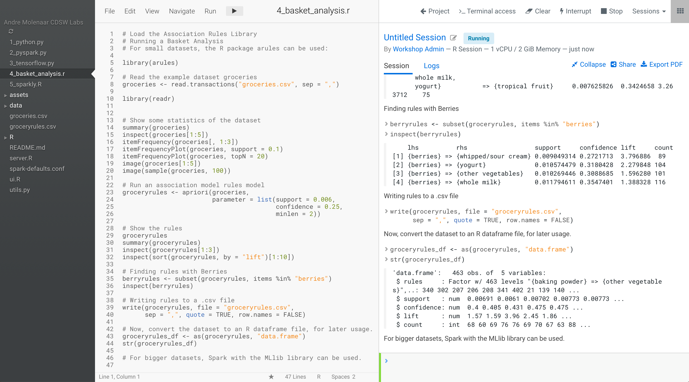

## Lab 6 - Running Spark in combination with R using sparklyr

Similar as in Lab 2, where we used Spark in combination with Python, you can also use Spark in combination with R. The library that makes that all easy, is sparklyr.

1. Clear your console output using the ```clear``` button.

2. Open the program ```5_sparkly.R``` in your editor, and run it.

3. Watch the program run and try to understand what it is doing. When the program has finnished, you should have something like below:

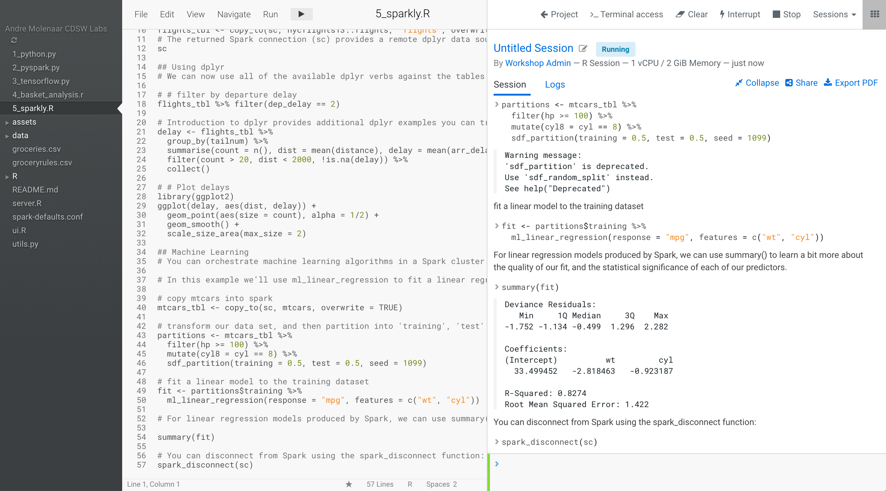

Scroll a bit upward to the Machine Learning section of the output, and have a read through it.

4.	Can you figure out some of the things it’s doing? If you know R, and if you know sparklyr, then you can get detailed; if you don’t know R then simply ```collapse``` the output and see if you can make sense of the analysis without looking at any code … hopefully you can!

5. Stop your R session by hitting the ```Stop``` button.

## Lab 7 - Scala

In this lab we show how you can use the ‘Template’ mechanism to get started with a simple Scala example. Note that the built in templates and example code aren’t written with multiple users in mind, so you might see file access and permission errors due to the fact that other students might’ve created or deleted files before you!

1. Navigate to the project space by selecting ```project```
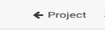
and then the ```All Projects``` link.


2. Create a new project by hitting the ‘+’ button on the top right and selecting ```create project```
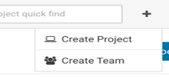

3.	In the Create new Project window that comes up provide a name for your new project (‘Scala’, for example), and then choose the Scala template in the Initial Setup drop down menu:

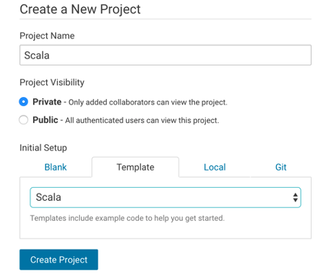

4.	Create the project. You’ll see the File Browser view onto the project:

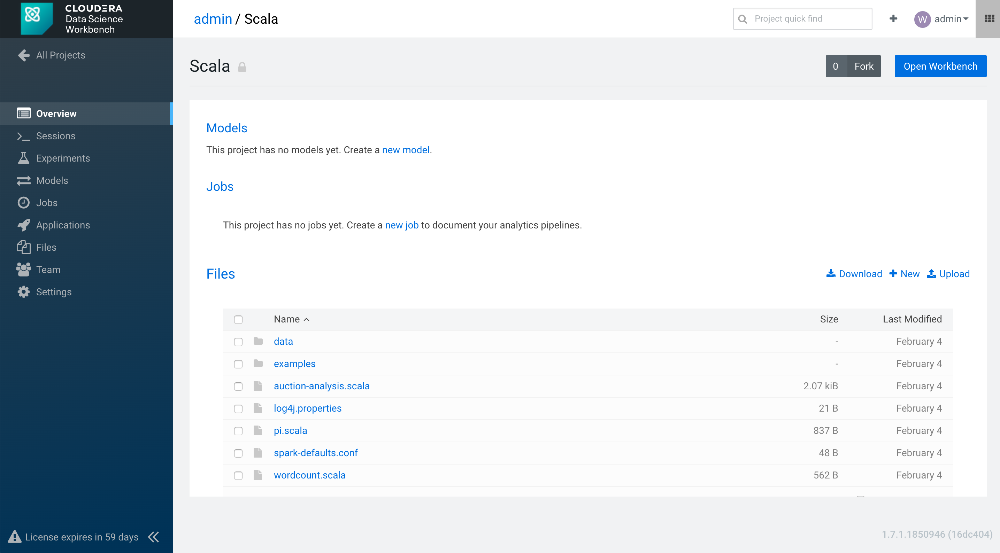
