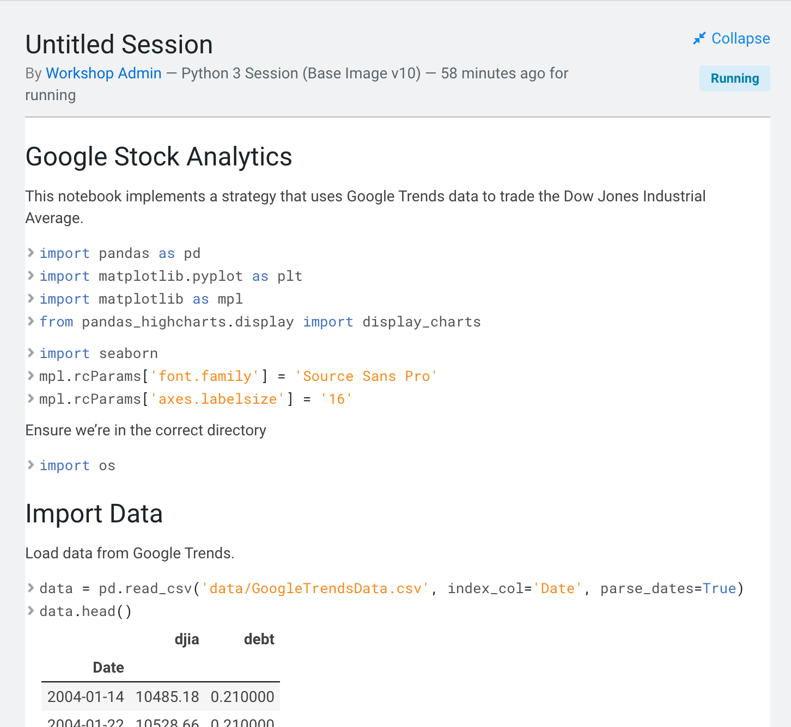
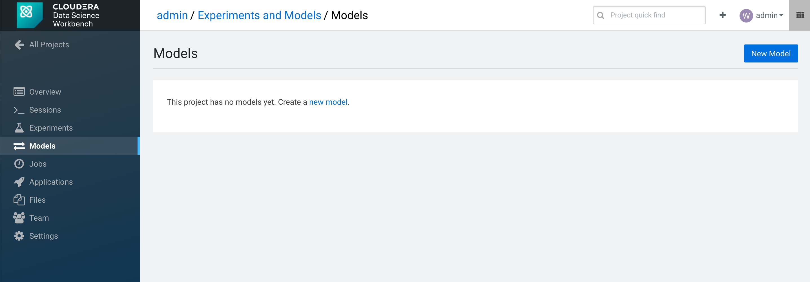

# Cloudera Data Science Workbench Handson Workshop
Tour of Cloudera Data Science Workbench / Cloudera Machine Learning

## Workbench
There are several scripts provided which walk through the interactive capabilities of Cloudera Data Science Workbench.

1. **Basic Python visualizations (Python 2).** Demonstrates:
  - Markdown via comments
  - Jupyter-compatible visualizations
  - Simple console sharing
2. **PySpark (Python 2).** Demonstrates:
  - Easy connectivity to (kerberized) Spark in YARN client mode.
  - Access to Hadoop HDFS and S3 (e.g. `hdfs dfs -ls /`).
3. **R** Demonstrates:
  - Run standalone R code on CDSW, showing arules library
  - Use sparklyr to benefit from the Spark engine in your R application
4. **Scala** Demonstrates:
  - Run Scala code on CDSW
5. **Jobs** Demonstrates:
  - Use the easy to use self-service batch framework
6. **Working with Experiments and Models** Demonstrates:
  - Batch interface for running experiments in Batch while changing hyperparameters.
  - Capture experiment key results
  - Deploy the best predictive model as a REST service
7. **Applications** Demonstrates:
  - Self-serivice framework to deploy your own applications


#  INTRODUCTION
Cloudera Data Science Workbench is a new product from Cloudera launched in May 2017. It is based on the acquisition of Sense.io that we made in March 2016. Cloudera has taken this product, enhanced it and ensured that all workloads can be pushed down to Cloudera.

&nbsp;

Cloudera Data Science workbench supports the R, Python, Scala programming languages. That capability could certainly be useful to Cloudera; the software could enable companies to make the most of their data scientists, who can then be more efficient with their use of company time and
infrastructure.

&nbsp;

Cloudera’s goal with Cloudera Data Science workbench is to Help more data scientists use the power of Hadoop, make it easy and secure to add new users, use cases.

Why Hadoop for Data Science? Well here are the reasons:
- High volume, low cost shared storage - More data more kinds of data
- Parallel compute local to the data - more experiments, better results
- Scalable, fault tolerant - easy to scale out, not just scale up
- Flexible multipurpose data platform - easier path to production
- Superior flexibility and price / performance to any other data platform

## Lab 1 - Login to Cloudera Data Science Workbench (CDSW)

In this lab you’ll learn how to:
- Login to a Cloudera Data Science Workbench instance
- Set your Hadoop Authentication
- Navigate the Cloudera Data Science Workbench application

First thing you need to use the provided http link to your Cloudera Data Science Workbench environment. Login to this environment using the user ```admin``` and the provided password.


## Lab 2 - Creating a new project
When you have logged in, you will se the following screen:


You have on the left hand panel:
- Projects - where you create data science projects
- Sessions - Python, Scala or R sessions
- Experiments - batch experiments
- Models - build, deploy, and manage models as REST APIs to serve predictions
- Jobs - Run and schedule jobs and add dependencies
- Applications - Run self-built applications
- Settings - User, Hadoop Authentication, SSH Keys and permission settings
- Admin - Manage your Cloudera Data Science Workbench environment

In the top right hand corner you have:
- **Search bar** for search for projects
- **+**	adding new projects or new teams
- **User name** Account settings and Sign out - Same as settings in home screen
-  menu to external tools like Hue, Cloudera Manager and others

Lets create a new project, by selecting the  button.

Copy and paste this GitHub URL into the Git tab.
```
https://github.com/andremolenaar/cdsw_workshop_v2.git
```
Project name = Something like your name and Labs, and hit the ```Create Project``` button.


When the project is created, you will see a screen similar to this:


Now, Launch a Python 3 Session by selecting the ```Open Workbench``` button, populate the options:
- Editor: workbench
- Engine Kernel: Python 3
- 1 vCPU / 2 GiB Memory
And hit the ```Launch Session``` button


After a few seconds, you will get to your workbench screen with a running Python3 engine.


1.	On the far left is a file browser (note the little ‘refresh’ icon at the top:  )
2.	In the middle is an editor open on the file that you selected - in this case the README.md file.
3.	On the right is your running session, with your python3 command prompt in the bottom. A green bar indicates it is ready to process something. When it is processing, it will turn red.

Lets enrich our Python3 environment with additional libraries.
Run the following commands from the python command prompt:

```Python
!pip3 install --upgrade dask
!pip3 install --upgrade keras
!pip3 install --upgrade matplotlib==2.0.0.
!pip3 install --upgrade pandas_highcharts
!pip3 install --upgrade protobuf
!pip3 install --upgrade tensorflow==1.3.0.
!pip3 install --upgrade seaborn
!pip3 install --upgrade numpy
```
You can copy all those statements, and paste it at the python3 prompt.
When the libraries have been installed, you should see something like this:


## Lab 3 - Visualization and Sharing

Data Science is often about visualizing ideas, and then sharing them to persuade others to take action. CDSW lets you use the visualization tools you’d use naturally, and adds a neat twist to the whole idea of sharing.

Let’s get started:
1.	Start up a Python 3 session (1vCPU, 2GiB) in the same manner you did before. If your Python session is still running, you may reuse it. You might want to hit the ```Clear``` button in the right top, to clean your console screen.
2.	Select 1_python.py in the file browser
3.	Run the entire file (multiple ways of doing that - try to figure out more than one way. It should be pretty obvious!). One way of doing it would be to select the ```Run``` menu above your program code.


4. You should end up with some nice graphs in the output window:


5. You can see that CDSW is very similar to a notebook, supporting the same visualization tools. However, unlike a notebook, it doesn’t use cells: instead it uses markup in the source file, and an output window. Furthermore, that window has some interesting properties …

6. Scroll up to find this diagram:


7. On the left is a little chain link button: 

8. Click on it and you’ll see beneath the chart some html that can be used to embed that chart into a website:


9. Scroll to the top of the window and you’ll see this on the far right (the exact layout depends upon the real estate available – you might have to expand your browser window to see the following links and they might be laid out vertically or horizontally):


10. Hit the ```collapse``` link and see the difference in the output window.

11. Question: What difference did you see? How might this be used? Is it useful?

12. Notebooks have great output, but how do you share what they show you? CDSW solves this by simply providing a link to the output that you can send to anyone and they can see the output. Try it:

13.	Select the ```Share``` link:


14.	And then ```Share with Others``` (your URL will be similar, but different from this one):


15.	Cut and paste that link and put it into another tab of your browser and see what happens.

16.	You should see that you have access to almost the same output window (this new one doesn’t have this share link!)



So we’ve demonstrated how CDSW is like a notebook, but is perhaps more powerful, and has great sharing capability. Let’s go on to see about integration with Hadoop and Cloud Object Stores.

## Lab 4 - Hadoop Integration
In this lesson we’ll see two mechanisms for integrating with Hadoop:
1. Filesystem - storing data in Hadoop itself using HDFS
2. Computation - executing code on the Hadoop cluster via Spark

Execute the following instructions.

1. Clean up your Python session by hitting the ```clear``` button and the ```expand``` link (if available)


2. Select the 2_pyspark.py file

3. If you don’t have a Python 3 workbench session open yet, Launch a Python 3 session 1 vCPU / 2 GB RAM

4. Run line 34. You can run the line by selecting the line, right mouse click, and select ```run line(s)```, or alternatively, select the line and using the ```Run``` menu:

5. ```!hdfs dfs -put -f $HOME/data/kmeans_data.txt /user/$HADOOP_USER_NAME```

6. Execute the 2_pyspark.py file in your already running Python session

7. Question: What did it do?

8. Question: What kind of thing is the variable ‘data’? (try typing ‘data’ into the console and seeing what gets printed out.

9. Click on the ```Spark UI``` link on the top of the console. You should see something like this:


10. The Spark UI can be used to understand how Spark is executing your application, which is very useful for debugging. Click around the Spark UI, notice the different stages the job went through. Also notice the execution time of all the steps of your job.

11. Once you are ready clicking around the Spark UI, navigate back the the ```Session```. In order close Spark processing, execute the following command in the console:

12. ```spark.stop()```

13. Open a terminal using the ```terminal``` icon in the top right:


14. Execute ```hdfs dfs -ls``` to see the data file in the hadoop file system (or, to show off, execute ```! hdfs dfs -ls``` in the python console to do the same thing!)


If everything went correctly you’ll see that we demonstrate:
-	Natural integration with HDFS - it’s just a path to a file!
-	Natural parallel computation across the cluster using Spark

15. You may stop your session now by hitting the ```Stop``` button above your session log.

## Lab 5 - Runnng R code

We’ve focused on python integration, but just to show we can do similar things with R, let’s take a look at the R programs and execute them.

This lab requires that R is setup with some additional libraries, similar like we did with Python before.

1. Create a new R Session.


2. In an R Session, run these commands:
```R
install.packages("tidyverse")
install.packages('sparklyr')
install.packages('plotly')
install.packages("nycflights13")
install.packages("Lahman")
install.packages("mgcv")
install.packages('shiny')
install.packages("arules")
install.packages("readr")
```
Installing these R libraries will take a couple of minutes. So this might be a good time to take a break.

2.	Select (and run) 4_basket_analysis.r
The right hand side output window should (eventually) look like this (more or less - depending on your screen real-estate):


## Lab 6 - Running Spark in combination with R using sparklyr

Similar as in Lab 2, where we used Spark in combination with Python, you can also use Spark in combination with R. The library that makes that all easy, is sparklyr.

1. Clear your console output using the ```clear``` button.

2. Open the program ```5_sparkly.R``` in your editor, and run it.

3. Watch the program run and try to understand what it is doing. When the program has finnished, you should have something like below:


Scroll a bit upward to the Machine Learning section of the output, and have a read through it.

4.	Can you figure out some of the things it’s doing? If you know R, and if you know sparklyr, then you can get detailed; if you don’t know R then simply ```collapse``` the output and see if you can make sense of the analysis without looking at any code … hopefully you can!

5. Stop your R session by hitting the ```Stop``` button.

## Lab 7 - Scala

In this lab we show how you can use the ‘Template’ mechanism to get started with a simple Scala example. Note that the built in templates and example code aren’t written with multiple users in mind, so you might see file access and permission errors due to the fact that other students might’ve created or deleted files before you!

1. Navigate to the project space by selecting ```project```

and then the ```All Projects``` link.


2. Create a new project by hitting the ‘+’ button on the top right and selecting ```create project```


3. In the Create new Project window that comes up provide a name for your new project (‘Scala’, for example), and then choose the Scala template in the Initial Setup drop down menu:


4. Create the project. You’ll see the File Browser view onto the project:


5. Hit ```Open Workbench``` in the top right and let’s go run some Scala code:

6. Start a Scala session


7. Open the ```examples``` folder in your file browser, and select the ```kmeans.scala``` program. This Scala example project includes its own data set that needs to be moved into HDFS, since that is where the scala code expects to find it. The data is copied to the tmp directory in HDFS, using the command in line 9 of the example.

8. Look at the lines 9 and 12. In line 9, the file ```kmeans_data.txt``` is copied to the /tmp directory on hdfs, and in line 12, that hdfs file is used by Spark. Unfortunately, the account that you are using in the workshop does not have file create privileges on the ```/tmp``` directory. So we need to change the statement a bit, so that it writes to our home directory on hdfs, which is ```/user/Admin```. Modify the statements as follows:

```
//load local data to hdfs
"hdfs dfs -put data/kmeans_data.txt /user/admin"

//example kmeans clustering script
val data = sc.textFile("/user/admin/kmeans_data.txt")
```


9. Run the program

Question: How will you use templates when demonstrating CDSW to your friends and colleagues?

Remember to stop your scala Session.

## Lab 8 - Scheduling Jobs

It’s often the case that you need to execute tasks on a periodic basis, and to execute one or more tasks once some other task has succeeded. Obviously there are sophisticated workflow engines but for simple workflows CDSW has a jobs system built in.

This lab goes through the mechanics of creating a simple multi-step job process.
1. Open up your ```xxx CDSW Labs``` project to get to this screen:


2. You need to be in a project to create a Job.

3. Select ```Jobs``` tab in the left menu, and then hit the ```new job``` link in the top-right corner of the page, and you’ll get to the following screen (there are other ways of getting to this next screen - its an exercise for the student to figure out what they might be):


4. Create  a job that will be triggered manually and will execute the 1_python.py. Here are the parameters to do that:

Variable | Value
--- | ---
Name | My New Job
Script | 1_python.py
Engine Kernel | Python 3

5. Leave everything else as default. Scroll down and hit ```Create Job```. You should get to this screen:


6. Here you can see that you have a job (‘My New Job’). It’s never been run, and it has no dependencies.

7. Let’s make other jobs depend on this one: Click the ```+ Add Job Dependency``` grayed out button and add a new job that has a dependency on ‘My New Job’. The parameters are:

Variable | Value
--- | ---
Name | Job 2
Script | 2_pyspark.py
Engine | Kernel	Python 3


8. Scroll down and ‘Create Job’. You’ll now see a page like this:


9. So here we can see that ‘Job 2’ depends upon ‘My New Job’ (although you can run each manually, if you so choose).

10. Let’s add another job that will run in parallel with Job2:

11. Click ‘New Job’ in the top right corner and create another job that depends upon ‘My New Job’. The parameters you’ll need are:

Variable | Value
--- | ---
Name | R Job
Script | 4_basket_analysis
Engine Kernel |R
Schedule | Dependant / My New Job

12. Create the job and you’ll see this:


13. Lets run it all - hit the ```Run``` button next to ‘My New Job’ (bottom of the list of jobs). You should see the job get scheduled, run, complete, and then the next two jobs should likewise get scheduled, run and complete:

Question: How will a job scheduler reduce the effort required for you to build simple pipelines?

Question: What other facilities surrounding a job did we not explain? What do you think those other parameters might do?

## Lab 9 - Experimenting

Starting with version 1.4, Cloudera Data Science Workbench allows data scientists to run batch experiments that track different versions of code, input parameters, and output (both metrics and files).

#### Challenge
As data scientists iteratively develop models, they often experiment with datasets, features, libraries, algorithms, and parameters. Even small changes can significantly impact the resulting model. This means data scientists need the ability to iterate and repeat similar experiments in parallel and on demand, as they rely on differences in output and scores to tune parameters until they obtain the best fit for the problem at hand. Such a training workflow requires versioning of the file system, input parameters, and output of each training run.

Without versioned experiments you would need intense process rigor to consistently track training artifacts (data, parameters, code, etc.), and even then it might be impossible to reproduce and explain a given result. This can lead to wasted time/effort during collaboration, not to mention the compliance risks introduced.

#### Solution
Starting with version 1.4, Cloudera Data Science Workbench uses experiments to facilitate ad-hoc batch execution and model training. Experiments are batch executed workloads where the code, input parameters, and output artifacts are versioned. This feature also provides a lightweight ability to track output data, including files, metrics, and metadata for comparison.

#### Concepts
The term experiment refers to a non interactive batch execution script that is versioned across input parameters, project files, and output. Batch experiments are associated with a specific project (much like sessions or jobs) and have no notion of scheduling; they run at creation time. To support versioning of the project files and retain run-level artifacts and metadata, each experiment is executed in an isolated container.

#### Lifecycle of an Experiment


1. Create a new project
Go to the homepage of your Data Science workbench, and create a ‘New’ project.
Call the new repository something like Experiments and Models.
Create the repository as a clone of the github repository:

```
https://github.com/andremolenaar/experiments_models_tellarius.git
```


2. Start a workbench with a Python 3 and 2 GB of memory.
When the workbench is available, open a terminal window and make the cdsw-build.sh program executable and run it. You can do this by entering the following commands:

```
chmod +x setup.sh
./setup.sh
```


3. Examin dsfortelco_sklearn_exp.py

Open the file “dsfortelco_sklearn_exp.py”. This is a python program that builds a churn model to predict customer churn (the likelihood that this customer is going to stop his subscription with his telecom operator). There is a dataset available on hdfs (/user/$HADOOP_USER_NAME/churn_all.csv), with customer data, including a churn indicator field.

The program is going to build a churn prediction model using the Random Forest algorithm. Random forests are ensembles of decision trees. Random forests are one of the most successful machine learning models for classification and regression. They combine many decision trees in order to reduce the risk of overfitting. Like decision trees, random forests handle categorical features, extend to the multiclass classification setting, do not require feature scaling, and are able to capture non-linearities and feature interactions.

spark.mllib supports random forests for binary and multiclass classification and for regression, using both continuous and categorical features. spark.mllib implements random forests using the existing decision tree implementation. Please see the decision tree guide for more information on trees.

The Random Forest algorithm expects a couple of parameters:
- numTrees: Number of trees in the forest.
Increasing the number of trees will decrease the variance in predictions, improving the model’s test-time accuracy.
Training time increases roughly linearly in the number of trees.
- maxDepth: Maximum depth of each tree in the forest.
Increasing the depth makes the model more expressive and powerful. However, deep trees take longer to train and are also more prone to overfitting.
In general, it is acceptable to train deeper trees when using random forests than when using a single decision tree. One tree is more likely to overfit than a random forest (because of the variance reduction from averaging multiple trees in the forest).

In the dsfortelco_pyspark_exp.py program, these parameters can be passed to the program at runtime. In the lines 39 and 40, these parameters are passed to python variables:
```
param_numTrees=int(sys.argv[1])
param_maxDepth=int(sys.argv[2])
```

Also note that at the lines 70 and 71, the quality indicator for the Random Forest model, are written back to the Data Science Workbench repository:
```
cdsw.track_metric("auroc", auroc)
cdsw.track_metric("ap", ap)
```

These indicators will show up later in the Experiments dashboard.

4. Run the experiment for the first time

Now, run the experiment using the following parameters:
numTrees = 40
numDepth = 20

From the menu, select ```Run``` -> ```Experiments```.


Specify the arguments for this run, by typing the numbers behind the arguments field. Note that these fields are separated by a space and that there is no comma (,)


Now, in the background, the Data Science Workbench environment will spin up a new docker container, where this program will run.

5. Check the results for the first experiment

Go back to the ‘Projects’ page in CDSW, and hit the ```Experiments``` button in the left menu bar. You should see something like this:


If the Status indicates ‘Running’, you have to wait till the run is completed.
In case the status is ‘Build Failed’ or ‘Failed’, check the log information. This is accessible by clicking on the run number of your experiments. There you can find the session log, as well as the build information.

In case your status indicates ‘Success’, you should be able to see the auroc (Area Under the Curve) model quality indicator. It might be that this value is hidden by the CDSW user interface. in that case, click on the ‘3 metrics’ links, and select the auroc field.


It might be needed to deselect some other fields, since the interface can only show 3 metrics at the same time.

In this example, the auroc is 0.845. Not bad, but maybe there are better hyper parameter values available.

6. Re-run the experiment several times

Now, re-run the experiment 3 more times and try different values for NumTrees and NumDepth. Try the following values:

NumTrees | numDepth
--- | ---
15 | 25
25 | 20
Try something yourself | Try something yourself

When all runs have completed successfully, check which parameters had the best quality (best predictive value). This is represented by the highest ‘area under the curve’, auroc metric.


In this example, run 2 had the highest auroc value, so that is the model that you would want to use for your business.

7. Save the best model to your environment

Select the run number with the best predictive value, in this example, run number 2, by clicking the link on the number ```2```.

In the Overview screen of the experiment, you can see that the model in spark format, is captured in the file ‘sklearn_rf.pkl’. Select this file and hit the ‘Add to Project’ button. This will copy the model to your project directory.


## Lab 10 - Working with Models

Starting with version 1.4, Cloudera Data Science Workbench allows data scientists to build, deploy, and manage models as REST APIs to serve predictions.

### Challenge
Data scientists often develop models using a variety of Python/R open source packages. The challenge lies in actually exposing those models to stakeholders who can test the model. In most organizations, the model deployment process will require assistance from a separate DevOps team who likely have their own policies about deploying new code.

For example, a model that has been developed in Python by data scientists might be rebuilt in another language by the devops team before it is actually deployed. This process can be slow and error-prone. It can take months to deploy new models, if at all. This also introduces compliance risks when you take into account the fact that the new re-developed model might not be even be an accurate reproduction of the original model.

Once a model has been deployed, you then need to ensure that the devops team has a way to rollback the model to a previous version if needed. This means the data science team also needs a reliable way to retain history of the models they build and ensure that they can rebuild a specific version if needed. At any time, data scientists (or any other stakeholders) must have a way to accurately identify which version of a model is/was deployed.

### Solution
Starting with version 1.4, Cloudera Data Science Workbench allows data scientists to build and deploy their own models as REST APIs. Data scientists can now select a Python or R function within a project file, and Cloudera Data Science Workbench will:

- Create a snapshot of model code, model parameters, and dependencies.
- Package a trained model into an immutable artifact and provide basic serving code.
- Add a REST endpoint that automatically accepts input parameters matching the function, and that returns a data structure that matches the function’s return type.
- Save the model along with some metadata.
- Deploy a specified number of model API replicas, automatically load balanced.

Stages of the Model Deployment Process:


1. Examine the program ```predic_churn_sklearn.py```

Open the project you created in the previous lab, and examine the file.


This PySpark program uses the pickle.load mechanism to deploy models.. The model it refers to the sklearn_rf.pkl file, was saved in the previous lab from the experiment with the best predictive model.

There is a predict definition which is the function that calls the model, using features, and will return a result variable.

2. Deploy the model

From the projects page of your project, select the ```Models``` button.



Select the ```New Model``` button, and populate specify the following configuration:

Variable | value
--- | ---
Name |		something like “My Churn Prediction Model”
Description |	Anything you want
File | predict_churn_sklearn.py
Function | predict
Example Inp |	{ "feature": "0, 65, 0, 137, 21.95, 83, 19.42, 111, 9.4, 6, 3.43, 4" }
Kernal | Python 3
Engine |	0.5 vCPU / 2 GiB Memory
Replicas |	1


If all parameters are set, you can hit the ```Deploy Model``` button. Wait until the model is deployed. This will take several minutes.


3. Test the deployed model

After several minutes, your model should get to the ‘Deployed’ state.


Now, click on the Model Name link, to go to the Model Overview page. From that page, hit the ```Test``` button to check if the model is working.


If your model is working, you should receive an output similar like this:


The green color with success is telling that our REST call to the model is technically working. And if you examine the response: {“result”: 1}, it returns a 1, which means that customer with these features is likely to churn.

Now, let’s change the input parameters and call the predict function again. Put the following values in the Input field:
```
{
  "feature": "0, 95, 0, 88, 26.62, 75, 21.05, 115, 8.65, 5, 3.32, 3"
}
```


With these input parameters, the model returns 0, which means that the customer is not likely to churn.

4. Model Administration

When a model is deployed, Cloudera Data Science Workbench allows you to specify a number of replicas that will be deployed to serve requests. For each active model, you can monitor its replicas by going to the model's Monitoring page. On this page you can track the number of requests being served by each replica, success and failure rates, and their associated stderr and stdout logs. Depending on future resource requirements, you can increase or decrease the number of replicas by re-deploying the model.


When you get to the re-deployment page, you can increase the number of replicas.


In order not to overload the cluster, hit the ‘Cancel’ button to return to the running model page.

Now, navigate to the ‘Monitoring’ tab.


Several statistics of the model are displayed, like the number of times the model has been called, have been processed, etc.

Logfile information is also available here. The most recent logs are at the top of the pane (see image). stderr logs are displayed next to a red bar while stdout logs are by a green bar. Note that model logs and statistics are only preserved so long as the individual replica is active. When a replica restarts (for example, in case of bad input) the logs also start with a clean slate.

Now, navigate to the ```Settings``` tab.


On the settings tab, you will be able to find the “Access Key” that is needed in order to call the model with a REST webservice call.

5. Test the rest service from a command line.

The last step in this workshop, is to test the predict function from another (virtual) machine, using the “curl” tool.

Navigate to the ```Overview``` tab of your running model.


Copy the whole shell statement, starting with ‘curl -H ….”

Open a workbench session, running python 2 with 2 GB of memory. When the session is available, open a Terminal. Now, paste the curl statement to the command prompt, and run the statement.


That completes our lab with models. Please, free up some resources for other people and new projects. So stop your workbench session. And from the Models page, also stop your deployed model.


